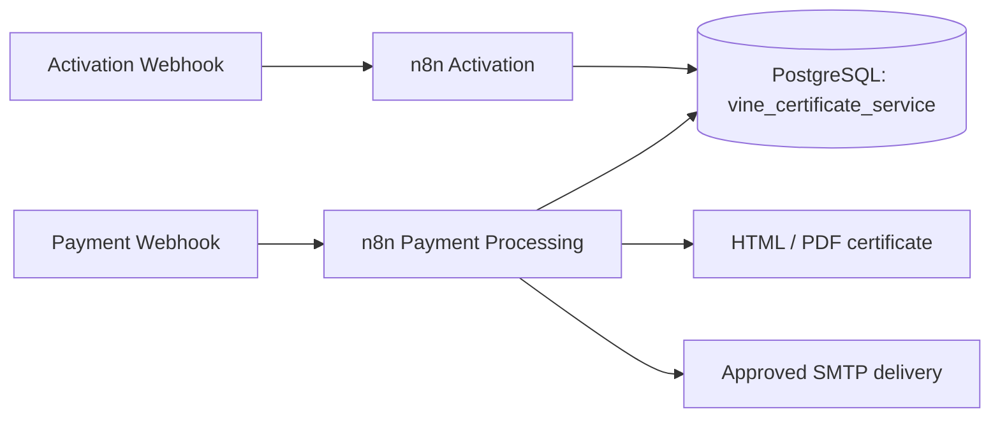

# Система выдачи сертификатов на именную виноградную лозу

Vine Certificate Service — n8n-мини-сервис для оформления оплаченного заказа, выдачи уникального сертификата, его активации и ведения истории лозы.

## Возможности

- Принимает тестовый webhook оплаты и валидирует входные данные.
- Не выдаёт сертификат для неоплаченного заказа.
- Защищает order_id, certificate_code и активацию от дублей.
- Формирует готовый к HTML→PDF шаблон сертификата.
- Сохраняет статусы заказа, активации и доставки в PostgreSQL.
- Активирует лозу и добавляет первое событие истории.
- Публикует read-only личную страницу активированной лозы с фото и историей обновлений.

## Личная страница лозы

После успешной активации workflow возвращает `personal_page_url`. Публичный route использует существующий n8n runtime и принимает только валидный certificate code:

`https://n8n.mag-astro.ru/webhook/vine?certificate_code=VINE-...`

Страница читает исключительно `vine_certificate_service.vines` и `vine_certificate_service.vine_updates`; записи, credentials и внутренние поля через неё недоступны. Некорректный или неизвестный code получает страницу «Сертификат не найден» с HTTP 404.

## Архитектура

## Быстрый запуск

1. Примените `database/schema.sql` к PostgreSQL Mag_OS.
2. Импортируйте `workflows/payment_processing.json`, `workflows/activation.json` и `workflows/personal_vine_page.json` в n8n.
3. После импорта привяжите существующий PostgreSQL credential к Postgres nodes. Для доставки используйте отдельный approved SMTP workflow/credential; он не экспортируется в репозиторий.
4. Используйте payload из `examples/`.

## Защита и ограничения

Workflow exports не содержат credentials, токенов, паролей, реальных email или приватных URL. Реальная платёжная система заменена test webhook. PDF хранится в project output/storage, а публикация ссылки зависит от выбранного storage adapter.

## Структура

`workflows/` — n8n exports, включая read-only personal page и database evidence UI; `database/` — schema; `templates/` — сертификат; `examples/` — безопасные payload; `docs/` — архитектура, тестирование и безопасность; `submission/` — материалы для сдачи.
